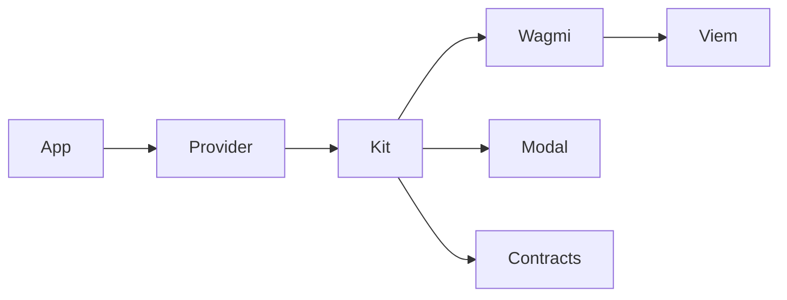

<p align="center">
  <a href="./README.md"></a>
  <a href="./README.ru.md"></a>
</p>

<div align="center">
  <picture>
    <source media="(prefers-color-scheme: dark)" srcset=".github/logo-dark.svg">
    <source media="(prefers-color-scheme: light)" srcset=".github/logo-light.svg">
    
  </picture>
  <h1>owlkit</h1>
  <p>Connect wallets and call contracts without assembling wagmi yourself.</p>
</div>

<div align="center">

[![License: MIT][license-shield]][license-url]
[![npm][version-shield]][version-url]
[![TypeScript][ts-shield]][ts-url]
[![React][react-shield]][react-url]

</div>

<div align="center">
  <a href="#quick-start">Quick Start</a> &middot;
  <a href="#usage">Usage</a> &middot;
  <a href="#read-and-write-contracts">Contracts</a> &middot;
  <a href="https://owlkit-docs-production.up.railway.app">Docs</a> &middot;
  <a href="https://www.npmjs.com/package/@owlkit/react">npm</a> &middot;
  <a href="https://github.com/selfowl/owlkit-react/issues">Issues</a>
</div>

---

## Why owlkit?

If you are shipping an EVM React app, you either take a heavy wallet UI or wire wagmi, viem, and TanStack Query by hand. OwlKit is a constructor over those three: one instance owns the modal, wallet list, theme, balances, and contract calls.

It is not a WalletConnect wrapper. Browser wallets arrive through EIP-6963. WalletConnect / Reown is opt-in.

## Features

- Configure wallets, theme, and labels on `new OwlKit()` — change them later with fluent setters
- Connect injected wallets out of the box; add WalletConnect only when you pass a project id
- Ship a connect modal and an account screen through `kit.open()` / `kit.close()`
- Keep account chrome in your app — `ConnectButton` only connects, then unmounts
- Read native and ERC-20 balances, then read or write any contract from the same kit
- Handle connect, disconnect, and user-rejected prompts through one `onError` stream
- Re-export the wagmi hooks you already know when you want to go headless

## When to use

| Use owlkit when | Look elsewhere when |
| --- | --- |
| You want a small EVM connect kit on React or Next.js | You need Solana, Bitcoin, or another non-EVM chain |
| You want to own the account menu and brand the modal | You want a hosted auth / embedded-wallet SaaS |
| You already like wagmi and do not want to assemble it | You need Vue or a backend-required flow |

## Quick Start

```bash
pnpm add @owlkit/react wagmi viem @tanstack/react-query
```

```tsx
import { OwlKit, OwlKitProvider, ConnectButton } from "@owlkit/react";
import "@owlkit/react/styles.css";

const kit = new OwlKit({
  appName: "my app",
  include: ["metamask", "rabby"],
});

export function App() {
  return (
    <OwlKitProvider kit={kit}>
      <ConnectButton />
    </OwlKitProvider>
  );
}
```

Create the kit once in a module, not inside render.

## Install

```bash
npm install @owlkit/react wagmi viem @tanstack/react-query
pnpm add @owlkit/react wagmi viem @tanstack/react-query
yarn add @owlkit/react wagmi viem @tanstack/react-query
```

Import styles once in the app:

```ts
import "@owlkit/react/styles.css";
```

WalletConnect is optional. If you want QR / mobile wallets, install `@walletconnect/ethereum-provider` and pass `walletConnect: { projectId }`.

## Usage

### Connect

`ConnectButton` opens the connect modal. After a wallet is connected it renders nothing — build your own account menu and call kit methods.

```tsx
import { ConnectButton, useOwlKit } from "@owlkit/react";

function Header() {
  const { connection, open, disconnect } = useOwlKit();

  return (
    <>
      <ConnectButton />
      {connection.isConnected ? (
        <button type="button" onClick={() => open()}>
          Account
        </button>
      ) : null}
      {connection.isConnected ? (
        <button type="button" onClick={() => disconnect()}>
          Disconnect
        </button>
      ) : null}
    </>
  );
}
```

```ts
kit.open();
kit.close();
kit.isOpen;
```

Disconnected `open()` shows the wallet list. Connected `open()` shows the shipped account screen (copy, explorer, disconnect).

### Headless

```ts
const { wallets, connect, disconnect, connection } = useOwlKit();

connection.isConnected;
connect("metamask");
disconnect();
```

### Balances

```ts
await kit.getBalance();
await kit.getBalance({
  token: "0xA0b86991c6218b36c1d19D4a2e9Eb0cE3606eB48",
});
await kit.getToken("0xA0b86991c6218b36c1d19D4a2e9Eb0cE3606eB48");
```

```ts
const { data } = useOwlBalance();
const { data: usdc } = useOwlBalance({
  token: "0xA0b86991c6218b36c1d19D4a2e9Eb0cE3606eB48",
});
```

## Read and write contracts

`readContract` and `writeContract` take an address, ABI, function name, and args. Failures go to `onError`, then throw so your `try/catch` still works. `erc20Abi` is re-exported from viem.

### Read

```ts
import { erc20Abi } from "@owlkit/react";

const allowance = await kit.readContract({
  address: "0xA0b86991c6218b36c1d19D4a2e9Eb0cE3606eB48",
  abi: erc20Abi,
  functionName: "allowance",
  args: [owner, spender],
});
```

### Write

```ts
const hash = await kit.writeContract({
  address: "0xA0b86991c6218b36c1d19D4a2e9Eb0cE3606eB48",
  abi: erc20Abi,
  functionName: "approve",
  args: [spender, amount],
});
```

Hooks from the same instance:

```ts
const { readContract, writeContract } = useOwlKit();
```

Closing a wallet prompt is not an application error:

```ts
try {
  await kit.writeContract({ address, abi, functionName, args });
} catch (error) {
  if (kit.isUserRejection(error)) return;
  throw error;
}
```

## Theme

Colors, overlay blur, type, and radius live on the instance. The modal is a solid surface. The overlay is a dim plus blur. OwlKit does not load fonts.

```ts
kit.setTheme({
  accent: "#18181b",
  modal: "#ffffff",
  overlay: "#09090b",
  overlayBlur: 8,
  font: "Inter, sans-serif",
  radius: { button: "pill", modal: 16 },
});
```

Layout knobs go through `theme.vars` (`--owlkit-modal-padding`, `--owlkit-icon-size`, and the rest of the shipped CSS variables).

## Events

```ts
const kit = new OwlKit({
  onConnect({ address, chain }) {},
  onDisconnect() {},
  onAccountChange({ address, previous }) {},
  onChainChange({ chainId, previous }) {},
  onError(error) {
    if (kit.isUserRejection(error)) return;
  },
});
```

Connect, disconnect, balance, and contract calls all report through `onError`.

## Constructor

| Option | What it does |
| --- | --- |
| `appName` | Shown in WalletConnect metadata and defaults |
| `logo` | URL or public path for the modal mark |
| `theme` | Colors, overlay, font, radius, CSS vars |
| `labels` | Connect / account copy |
| `include` / `exclude` | Wallet whitelist / blacklist |
| `injected` | EIP-6963 discovery (on by default) |
| `walletConnect` | `{ projectId }` to enable QR / mobile |
| `chains` | wagmi chains; default `mainnet`, `base`, `sepolia` |
| `ssr` | Cookie storage for Next.js (on by default) |
| `onError` | Shared error sink |

```ts
kit.setTheme({ accent: "#7c5cff" })
  .setLabels({ connect: "Connect" })
  .show("metamask", "rabby")
  .hide("injected")
  .useWalletConnect({ projectId });
```

### Wallet ids

Matching is case-insensitive and accepts common display names.

| Id | Notes |
| --- | --- |
| `metamask` | Injected |
| `rabby` | Injected |
| `coinbase` | Injected |
| `rainbow` | Injected |
| `brave` | Injected |
| `phantom` | Injected EVM |
| `tronlink` | Injected |
| `injected` | Generic fallback |
| `walletconnect` | Only if `walletConnect.projectId` is set |

## Next.js

Keep `OwlKitProvider` in a client component. Hydrate wagmi from cookies so the connected address does not flash.

```ts
import { cookieToInitialState } from "@owlkit/react";
import { headers } from "next/headers";

const initialState = cookieToInitialState(
  kit.getConfig(),
  (await headers()).get("cookie"),
);

<OwlKitProvider kit={kit} initialState={initialState}>
  {children}
</OwlKitProvider>
```

## Development

```bash
pnpm install
pnpm typecheck
pnpm build
```

## Prerequisites

| Requirement | Version |
| --- | --- |
| Node.js | 18+ |
| React / React DOM | 18+ |
| wagmi | 2+ |
| viem | 2+ |
| TanStack Query | 5+ |
| `@walletconnect/ethereum-provider` | optional |

## How it works

OwlKit builds a wagmi config, owns the connect/account modal, and exposes balance and contract helpers on the same instance. You keep wagmi for anything the kit does not wrap.



## Contributing

See [CONTRIBUTING.md](CONTRIBUTING.md) for local setup and pull-request notes.

## License

MIT — see [LICENSE](LICENSE).

## Acknowledgments

OwlKit sits on [wagmi](https://wagmi.sh), [viem](https://viem.sh), and [TanStack Query](https://tanstack.com/query).

<p align="right"><a href="#owlkit">back to top</a></p>

[license-shield]: https://img.shields.io/badge/License-MIT-18181b?style=flat-square
[license-url]: LICENSE
[version-shield]: https://img.shields.io/npm/v/@owlkit/react?style=flat-square&color=18181b
[version-url]: https://www.npmjs.com/package/@owlkit/react
[ts-shield]: https://img.shields.io/badge/TypeScript-5.x-3178C6?style=flat-square&logo=typescript&logoColor=white
[ts-url]: https://www.typescriptlang.org
[react-shield]: https://img.shields.io/badge/React-18+-087EA4?style=flat-square&logo=react&logoColor=white
[react-url]: https://react.dev
