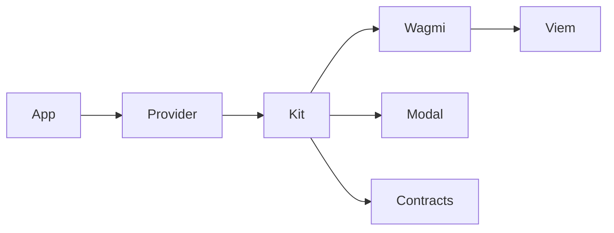

<p align="center">
  <a href="./README.md"></a>
  <a href="./README.ru.md"></a>
</p>

<div align="center">
  <picture>
    <source media="(prefers-color-scheme: dark)" srcset=".github/logo-dark.svg">
    <source media="(prefers-color-scheme: light)" srcset=".github/logo-light.svg">
    
  </picture>
  <h1>owlkit</h1>
  <p>Подключайте кошельки и вызывайте контракты — без самостоятельной сборки wagmi.</p>
</div>

<div align="center">

[![License: MIT][license-shield]][license-url]
[![npm][version-shield]][version-url]
[![TypeScript][ts-shield]][ts-url]
[![React][react-shield]][react-url]

</div>

<div align="center">
  <a href="#быстрый-старт">Быстрый старт</a> &middot;
  <a href="#использование">Использование</a> &middot;
  <a href="#чтение-и-запись-контрактов">Контракты</a> &middot;
  <a href="https://www.npmjs.com/package/@owlkit/react">npm</a> &middot;
  <a href="https://github.com/selfowl/owlkit-react/issues">Issues</a>
</div>

---

## Зачем owlkit?

Если вы делаете EVM-приложение на React, обычно остаётся два пути: тяжёлый готовый UI кошелька или ручная сборка wagmi, viem и TanStack Query. OwlKit — конструктор над этими тремя: один экземпляр держит модалку, список кошельков, тему, балансы и вызовы контрактов.

Это не обёртка над WalletConnect. Браузерные кошельки приходят через EIP-6963. WalletConnect / Reown подключается отдельно, если вы сами передадите project id.

## Возможности

- Кошельки, тема и тексты задаются в `new OwlKit()` и меняются сеттерами позже
- Injected-кошельки работают сразу; WalletConnect появляется только с `projectId`
- Модалка коннекта и экран аккаунта открываются через `kit.open()` / `kit.close()`
- Меню аккаунта остаётся вашим: `ConnectButton` только коннектит и затем размонтируется
- Нативный и ERC-20 баланс, чтение и запись любого контракта — с того же инстанса
- Коннект, дисконнект и отказ в кошельке идут в один поток `onError`
- Хуки wagmi реэкспортируются, если нужен headless-режим

## Когда использовать

| Берите owlkit, если | Ищите другое, если |
| --- | --- |
| Нужен небольшой EVM-кит для React или Next.js | Нужны Solana, Bitcoin или другая не-EVM сеть |
| Хотите своё меню аккаунта и свою тему модалки | Нужен хостовый auth / embedded-wallet SaaS |
| Уже знакомы с wagmi и не хотите собирать его сами | Нужен Vue или обязательный бэкенд |

## Быстрый старт

```bash
pnpm add @owlkit/react wagmi viem @tanstack/react-query
```

```tsx
import { OwlKit, OwlKitProvider, ConnectButton } from "@owlkit/react";
import "@owlkit/react/styles.css";

const kit = new OwlKit({
  appName: "my app",
  include: ["metamask", "rabby"],
});

export function App() {
  return (
    <OwlKitProvider kit={kit}>
      <ConnectButton />
    </OwlKitProvider>
  );
}
```

Создавайте кит один раз в модуле, не внутри `render`.

## Установка

```bash
npm install @owlkit/react wagmi viem @tanstack/react-query
pnpm add @owlkit/react wagmi viem @tanstack/react-query
yarn add @owlkit/react wagmi viem @tanstack/react-query
```

Стили подключите один раз в приложении:

```ts
import "@owlkit/react/styles.css";
```

WalletConnect необязателен. Для QR / мобильных кошельков поставьте `@walletconnect/ethereum-provider` и передайте `walletConnect: { projectId }`.

## Использование

### Коннект

`ConnectButton` открывает модалку коннекта. После подключения он ничего не рисует — меню аккаунта собираете сами и вызываете методы кита.

```tsx
import { ConnectButton, useOwlKit } from "@owlkit/react";

function Header() {
  const { connection, open, disconnect } = useOwlKit();

  return (
    <>
      <ConnectButton />
      {connection.isConnected ? (
        <button type="button" onClick={() => open()}>
          Аккаунт
        </button>
      ) : null}
      {connection.isConnected ? (
        <button type="button" onClick={() => disconnect()}>
          Отключить
        </button>
      ) : null}
    </>
  );
}
```

```ts
kit.open();
kit.close();
kit.isOpen;
```

Если кошелёк не подключён, `open()` показывает список. Если подключён — экран аккаунта (копирование, explorer, disconnect).

### Headless

```ts
const { wallets, connect, disconnect, connection } = useOwlKit();

connection.isConnected;
connect("metamask");
disconnect();
```

### Балансы

```ts
await kit.getBalance();
await kit.getBalance({
  token: "0xA0b86991c6218b36c1d19D4a2e9Eb0cE3606eB48",
});
await kit.getToken("0xA0b86991c6218b36c1d19D4a2e9Eb0cE3606eB48");
```

```ts
const { data } = useOwlBalance();
const { data: usdc } = useOwlBalance({
  token: "0xA0b86991c6218b36c1d19D4a2e9Eb0cE3606eB48",
});
```

## Чтение и запись контрактов

`readContract` и `writeContract` принимают адрес, ABI, имя функции и аргументы. Ошибки уходят в `onError`, затем пробрасываются — `try/catch` по-прежнему работает. `erc20Abi` реэкспортируется из viem.

### Чтение

```ts
import { erc20Abi } from "@owlkit/react";

const allowance = await kit.readContract({
  address: "0xA0b86991c6218b36c1d19D4a2e9Eb0cE3606eB48",
  abi: erc20Abi,
  functionName: "allowance",
  args: [owner, spender],
});
```

### Запись

```ts
const hash = await kit.writeContract({
  address: "0xA0b86991c6218b36c1d19D4a2e9Eb0cE3606eB48",
  abi: erc20Abi,
  functionName: "approve",
  args: [spender, amount],
});
```

Хуки с того же инстанса:

```ts
const { readContract, writeContract } = useOwlKit();
```

Закрытый промпт кошелька — не ошибка приложения:

```ts
try {
  await kit.writeContract({ address, abi, functionName, args });
} catch (error) {
  if (kit.isUserRejection(error)) return;
  throw error;
}
```

## Тема

Цвета, блюр оверлея, шрифт и радиусы живут на инстансе. Модалка — сплошная поверхность. Оверлей — затемнение плюс blur. Шрифты OwlKit сам не грузит.

```ts
kit.setTheme({
  accent: "#18181b",
  modal: "#ffffff",
  overlay: "#09090b",
  overlayBlur: 8,
  font: "Inter, sans-serif",
  radius: { button: "pill", modal: 16 },
});
```

Отступы и размеры — через `theme.vars` (`--owlkit-modal-padding`, `--owlkit-icon-size` и остальные CSS-переменные кита).

## События

```ts
const kit = new OwlKit({
  onConnect({ address, chain }) {},
  onDisconnect() {},
  onAccountChange({ address, previous }) {},
  onChainChange({ chainId, previous }) {},
  onError(error) {
    if (kit.isUserRejection(error)) return;
  },
});
```

Коннект, дисконнект, балансы и контракты сообщают об ошибках через `onError`.

## Конструктор

| Опция | Назначение |
| --- | --- |
| `appName` | Имя в метаданных WalletConnect и дефолтах |
| `logo` | URL или public-путь марки в модалке |
| `theme` | Цвета, оверлей, шрифт, радиусы, CSS-переменные |
| `labels` | Тексты кнопки и экрана аккаунта |
| `include` / `exclude` | Белый / чёрный список кошельков |
| `injected` | Обнаружение EIP-6963 (включено по умолчанию) |
| `walletConnect` | `{ projectId }` включает QR / мобайл |
| `chains` | Сети wagmi; по умолчанию `mainnet`, `base`, `sepolia` |
| `ssr` | Cookie-хранилище для Next.js (включено по умолчанию) |
| `onError` | Общий обработчик ошибок |

```ts
kit.setTheme({ accent: "#7c5cff" })
  .setLabels({ connect: "Connect" })
  .show("metamask", "rabby")
  .hide("injected")
  .useWalletConnect({ projectId });
```

### Идентификаторы кошельков

Сравнение без учёта регистра, плюс обычные display-имена.

| Id | Заметки |
| --- | --- |
| `metamask` | Injected |
| `rabby` | Injected |
| `coinbase` | Injected |
| `rainbow` | Injected |
| `brave` | Injected |
| `phantom` | Injected EVM |
| `tronlink` | Injected |
| `injected` | Общий fallback |
| `walletconnect` | Только если задан `walletConnect.projectId` |

## Next.js

Держите `OwlKitProvider` в клиентском компоненте. Гидратируйте wagmi из cookie, чтобы адрес не мигал.

```ts
import { cookieToInitialState } from "@owlkit/react";
import { headers } from "next/headers";

const initialState = cookieToInitialState(
  kit.getConfig(),
  (await headers()).get("cookie"),
);

<OwlKitProvider kit={kit} initialState={initialState}>
  {children}
</OwlKitProvider>
```

## Разработка

```bash
pnpm install
pnpm typecheck
pnpm build
```

## Требования

| Что | Версия |
| --- | --- |
| Node.js | 18+ |
| React / React DOM | 18+ |
| wagmi | 2+ |
| viem | 2+ |
| TanStack Query | 5+ |
| `@walletconnect/ethereum-provider` | необязательно |

## Как это устроено

OwlKit собирает wagmi-конфиг, держит модалку коннекта/аккаунта и отдаёт хелперы баланса и контрактов на том же инстансе. Всё, что кит не оборачивает, остаётся обычным wagmi.



## Контрибут

Локальный запуск и правила PR — в [CONTRIBUTING.md](CONTRIBUTING.md).

## Лицензия

MIT — см. [LICENSE](LICENSE).

## Благодарности

OwlKit стоит на [wagmi](https://wagmi.sh), [viem](https://viem.sh) и [TanStack Query](https://tanstack.com/query).

<p align="right"><a href="#owlkit">наверх</a></p>

[license-shield]: https://img.shields.io/badge/License-MIT-18181b?style=flat-square
[license-url]: LICENSE
[version-shield]: https://img.shields.io/npm/v/@owlkit/react?style=flat-square&color=18181b
[version-url]: https://www.npmjs.com/package/@owlkit/react
[ts-shield]: https://img.shields.io/badge/TypeScript-5.x-3178C6?style=flat-square&logo=typescript&logoColor=white
[ts-url]: https://www.typescriptlang.org
[react-shield]: https://img.shields.io/badge/React-18+-087EA4?style=flat-square&logo=react&logoColor=white
[react-url]: https://react.dev
